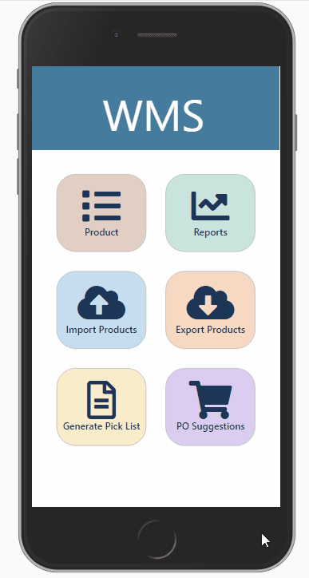

# WMS
A full stack web application for Warehouse Inventory Management System

## Technologies Used
* Babel
* Bootstrap 4
* CSS3
* Express
* Figma
* HTML5
* JavaScript ES6
* Meistertask
* Node.js
* npm
* Pgweb
* PostgreSQL
* React
* Webpack

## Live Demo
Coming Soon!

## Preview


## Features
* User can view the products list - Back End
* User can view the products list - Front End
* User can view products details and image - Back End
* User can view products details and iamge - Front End
* User can add new products to inventory - Back End
* User can add new products to inventory - Front End
* User can change status of product in 'Product Details' - Back End
* User can change status of product in 'Product Details' - Front End
* User can change status of products - Back End
* User can change status of products - Front End
* User can edit existing product details and inventory - Back End
* User can edit existing product details and inventory - Front End
* User can add new products to inventory - Back End
* User can add new products to inventory - Front End
* User can generate reports by low inventory - Back End
* User can generate reports by low inventory - Front End
* User can sort or filter products list by attributes - Back End
* User can sort or filter products list by attributes - Front End
* User can import products by CSV files - Back End
* User can import products by CSV files - Front End
* User can download current inventory by attributes - Back End
* User can download current inventory by attributes - Front End
* User can view inventory by category report as a graph - Back End
* User can view inventory by category report as a graph - Front End
* User can import sku quantity to generate a downloadable pick list with product's location - Back End
* User can import sku quantity to generate a downloadable pick list with product's location - Front End
* User can get estimate PO by budget - Back End
* User can get estimate PO by budget - Front End

## Getting Started
1. Clone the repository.
   ```shell
   git clone https://github.com/yanganboada/WMS
   cd wms
    ```

2. Install all dependencies with npm.
   ```shell
   npm install
   ```

3. Start the project. Once started you can view the application by opening http://localhost:3000 in your browser.

   ```shell
    npm run dev
    ```
